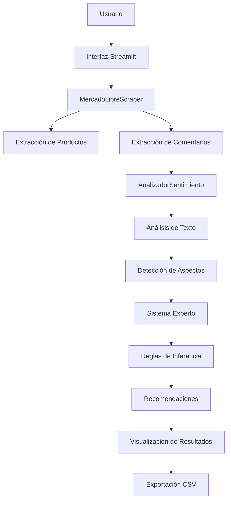

# 🛒 MLSENSE - Análisis Inteligente de Productos en MercadoLibre

<div align="center">


*Sistema híbrido que combina scraping, análisis de sentimientos y reglas de un sistema experto para analizar reseñas de productos en MercadoLibre Argentina.*

[Demo en vivo](#-demo) • [Instalación](#-instalación) • [Uso](#-uso) • [Documentación](#-documentación)

</div>

---

## 📋 Tabla de Contenidos

- [Descripción](#-descripción)
- [Características](#-características)
- [Arquitectura del Sistema](#-arquitectura-del-sistema)
- [Instalación](#-instalación)
- [Uso](#-uso)
- [Sistema Experto](#-sistema-experto)
- [Análisis de Sentimientos](#-análisis-de-sentimientos)
- [Estructura del Proyecto](#-estructura-del-proyecto)
- [Ejemplos](#-ejemplos)
- [Limitaciones](#-limitaciones)
- [Contribución](#-contribución)
- [Licencia](#-licencia)
- [Autores](#-autores)

---

## 🎯 Descripción

**MLSENSE** es una aplicación web desarrollada con Streamlit que permite extraer, analizar y recomendar productos desde MercadoLibre Argentina mediante técnicas de web scraping, procesamiento de lenguaje natural y sistemas expertos.

### ¿Qué hace este proyecto?

- 🔍 **Scraping inteligente** de productos y comentarios de MercadoLibre
- 🧠 **Análisis de sentimientos** usando modelos basados en diccionarios
- 🎯 **Detección de aspectos** como aroma, precio y envío
- 🤖 **Sistema experto** con reglas explicables para recomendaciones
- 📊 **Visualización interactiva** de resultados y métricas
- 📥 **Exportación** de datos en formato CSV

---

## ✨ Características

### 🚀 Web Scraping Avanzado
- Extracción de hasta **250 productos** por sesión
- Soporte para **múltiples páginas** (1-5 páginas)
- **Rotación de User-Agents** para evitar bloqueos
- **Pausas inteligentes** entre solicitudes
- **Extracción de comentarios** con puntuaciones

### 🧠 Análisis de Sentimientos
- **Modelo basado en diccionarios** optimizado para español
- **Detección de modificadores** (muy, super, bastante)
- **Manejo de negaciones** (no, nunca, jamás)
- **Puntuación 1-5 estrellas** automática
- **Comparación** con calificaciones originales

### 🎯 Sistema Experto
- **Reglas de inferencia** basadas en conocimiento del dominio
- **Detección automática de aspectos** relevantes
- **Recomendaciones explicables** y trazables
- **Lógica simbólica** para decisiones transparentes

### 📊 Interfaz de Usuario
- **Dashboard interactivo** con Streamlit
- **4 pestañas organizadas** (Datos, Sentimientos, Sistema Experto, Descargas)
- **Métricas en tiempo real** y visualizaciones
- **Exportación a CSV** de todos los resultados

---

## 🏗️ Arquitectura del Sistema



---

## 🛠️ Instalación

### Prerrequisitos

- Python 3.7 o superior
- pip (gestor de paquetes)
- Conexión a internet

### Instalación Rápida

```bash
# Clonar el repositorio
git clone https://github.com/alemeds/mlsense.git
cd mlsense

# Instalar dependencias
pip install -r requirements.txt

# Ejecutar la aplicación
streamlit run ml_scraper_final.py
```

### Dependencias

```txt
streamlit>=1.28.0
pandas>=1.5.0
requests>=2.25.0
beautifulsoup4>=4.9.0
lxml>=4.6.0
```

---

## 🚀 Uso

### 1. Configuración Inicial

1. **Abrir la aplicación** en el navegador (normalmente `http://localhost:8501`)
2. **Configurar parámetros** en el panel lateral:
   - Término de búsqueda (ej: "vinos malbec")
   - Número de páginas (1-5)
   - Activar extracción de comentarios
   - Seleccionar cantidad de productos

### 2. Ejecutar Análisis

```python
# Ejemplo de configuración recomendada
Término: "vinos tintos"
Páginas: 2
Comentarios: Activado
Productos: 50
Tiempo estimado: ~8-10 minutos
```

### 3. Revisar Resultados

- **📊 Datos Extraídos**: Tabla con información básica de productos
- **🎯 Análisis de Sentimientos**: Rankings y métricas de sentimientos
- **🧠 Sistema Experto**: Recomendaciones basadas en reglas
- **📥 Descargas**: Exportación en formato CSV

---

## 🤖 Sistema Experto

### Reglas de Inferencia

El sistema experto aplica las siguientes reglas en orden de prioridad:

#### 🏆 Regla 1: Recomendación Total
```
SI (sentimiento = positivo) Y (aroma detectado) Y (precio mencionado)
ENTONCES "RECOMENDADO: Buen aroma y buena relación precio-calidad"
```

#### 🚚 Regla 2: Recomendación por Envío
```
SI (sentimiento = positivo) Y (envío mencionado)
ENTONCES "RECOMENDADO: Envío rápido y sentimiento positivo"
```

#### 👃 Regla 3: Recomendación por Aroma
```
SI (sentimiento = positivo) Y (aroma detectado)
ENTONCES "RECOMENDADO: Principalmente por su aroma"
```

#### ❌ Regla 4: No Recomendado
```
SI (sentimiento = negativo)
ENTONCES "NO RECOMENDADO: Evaluación negativa"
```

### Detección de Aspectos

- **🍷 Aroma**: aromático, fragancia, bouquet, nariz, frutado, floral
- **💰 Precio**: barato, económico, relación calidad-precio, caro, inversión
- **📦 Envío**: entrega, rápido, llegó, demora, shipping, delivery

---

## 📊 Análisis de Sentimientos

### Algoritmo de Procesamiento

1. **Normalización**: Conversión a minúsculas, eliminación de acentos
2. **Tokenización**: División en palabras individuales
3. **Análisis contextual**: Ventana de 3 palabras para modificadores
4. **Puntuación**: Cálculo basado en diccionarios de palabras
5. **Normalización final**: Escala 1-5 estrellas

### Diccionarios Utilizados

- **Palabras Positivas**: excelente, bueno, increíble, recomendable, premium
- **Palabras Negativas**: malo, horrible, terrible, decepcionante, rancio
- **Modificadores**: muy, super, bastante, extremadamente
- **Negadores**: no, nunca, jamás, tampoco

### Fórmula de Cálculo

```python
sentimiento_final = 3.0 + (promedio_palabras * 2.0)
resultado = max(1.0, min(5.0, sentimiento_final))
```

---

## 📁 Estructura del Proyecto

```
mlsense/
├── ml_scraper_final.py          # Aplicación principal
├── requirements.txt              # Dependencias
├── README.md                    # Documentación
├── docs/                        # Documentación adicional
│   ├── diagrama_flujo.md
│   └── manual_tecnico.md
├── examples/                    # Ejemplos de uso
│   ├── ejemplo_productos.csv
│   └── ejemplo_sentimientos.csv
└── assets/                      # Recursos multimedia
    ├── demo.gif
    └── architecture.png
```

---

## 🎯 Ejemplos

### Ejemplo 1: Análisis Rápido
```bash
# Configuración para prueba rápida (2-3 minutos)
Término: "vino malbec"
Páginas: 1
Productos con comentarios: 10
```

### Ejemplo 2: Análisis Completo
```bash
# Configuración para análisis exhaustivo (20-25 minutos)
Término: "vinos premium"
Páginas: 5
Productos con comentarios: 200
```

### Resultados de Ejemplo

| Producto | Sentimiento | Calificación Original | Recomendación |
|----------|-------------|----------------------|---------------|
| Vino Malbec Premium | 4.7 ⭐ | 4.5 | RECOMENDADO: Buen aroma y precio |
| Vino Tinto Reserva | 4.2 ⭐ | 4.0 | RECOMENDADO: Por su aroma |
| Vino Económico | 2.1 ⭐ | 2.5 | NO RECOMENDADO: Evaluación negativa |

---

## ⚠️ Limitaciones

### Técnicas
- **Dependiente de la estructura** actual de MercadoLibre
- **Rate limiting** automático para evitar bloqueos
- **Comentarios limitados** (no todos los productos tienen reseñas)
- **Scraping ético** con pausas entre solicitudes

### Funcionales
- **Solo MercadoLibre Argentina** actualmente
- **Análisis en español** únicamente
- **Máximo 250 productos** por sesión
- **Tiempo de procesamiento** variable según la configuración

### Recomendaciones de Uso
- **Horarios de baja actividad** para mejor rendimiento
- **Términos específicos** mejoran la calidad de resultados
- **Guardar resultados** frecuentemente en sesiones largas

---

## 🤝 Contribución

¡Las contribuciones son bienvenidas! Sigue estos pasos:

### 1. Fork del Proyecto
```bash
git clone https://github.com/alemeds/mlsense.git
```

### 2. Crear Rama de Feature
```bash
git checkout -b feature/nueva-funcionalidad
```

### 3. Commit de Cambios
```bash
git commit -m 'Agregar nueva funcionalidad'
```

### 4. Push a la Rama
```bash
git push origin feature/nueva-funcionalidad
```

### 5. Abrir Pull Request

### Áreas de Mejora

- [ ] Soporte para otros países de MercadoLibre
- [ ] Análisis de sentimientos con ML avanzado
- [ ] API REST para integración
- [ ] Base de datos para almacenamiento histórico
- [ ] Visualizaciones gráficas avanzadas
- [ ] Sistema de alertas y notificaciones

---

## 📄 Licencia

Este proyecto está bajo la Licencia MIT. Ver el archivo [LICENSE](LICENSE) para más detalles.

```
MIT License

Copyright (c) 2025 MLSENSE Team - Grupo 7 UNICABA

Permission is hereby granted, free of charge, to any person obtaining a copy
of this software and associated documentation files (the "Software"), to deal
in the Software without restriction, including without limitation the rights
to use, copy, modify, merge, publish, distribute, sublicense, and/or sell
copies of the Software, and to permit persons to whom the Software is
furnished to do so, subject to the following conditions:

The above copyright notice and this permission notice shall be included in all
copies or substantial portions of the Software.
```

---

## 👥 Autores

### 👨‍💻 Equipo de Desarrollo - Grupo 7

| Integrante | Rol | Especialización |
|------------|-----|-----------------|
| **Martínez, Antonio** | Desarrollador Principal & Arquitecto de Sistemas | Web Scraping, Arquitectura de Software |
| **Vivona, Omar** | Especialista en Análisis de Datos | Procesamiento de Datos, Visualización |
| **Pereyra, Carolina** | Analista de Sistemas Expertos | Lógica de Negocio, Reglas de Inferencia |
| **Funes, Camila** | Especialista en NLP & Sentimientos | Procesamiento de Lenguaje Natural, Análisis de Sentimientos |
| **Ramírez Moreale, Nicolás** | Líder de Proyecto & Integración | Coordinación General, Testing, Documentación |

### 🏛️ Información Académica

- **Institución**: Universidad de la Ciudad de Buenos Aires (UNICABA)
- **Carrera**: Licenciatura en Ciencias de Datos
- **Materia**: Análisis de Datos II
- **Año**: 2025
- **Grupo**: 7
- **Profesor**: [Nombre del Profesor]

### 🎯 Contribuciones por Integrante

#### Antonio Martínez
- 🔧 **Desarrollo del scraper principal** y optimización de requests
- 🏗️ **Arquitectura de la aplicación** Streamlit
- 🛡️ **Manejo de errores** y validaciones robustas
- 📊 **Interfaz de usuario** y experiencia de usuario

#### Omar Vivona
- 📈 **Análisis estadístico** de los datos extraídos
- 📊 **Métricas y dashboards** de visualización
- 🔍 **Calidad de datos** y validación de resultados
- 📉 **Optimización de rendimiento** del análisis

#### Carolina Pereyra
- 🧠 **Diseño del sistema experto** y reglas de inferencia
- 🎯 **Lógica de recomendaciones** basada en aspectos
- 📚 **Documentación técnica** del sistema experto
- 🔄 **Testing de reglas** y casos de uso

#### Camila Funes
- 🗣️ **Desarrollo del analizador de sentimientos** en español
- 📝 **Diccionarios de palabras** positivas/negativas/modificadores
- 🔍 **Detección de aspectos** en comentarios
- 🧪 **Evaluación de precisión** del modelo de sentimientos

#### Nicolás Ramírez Moreale
- 👥 **Coordinación del equipo** y gestión del proyecto
- 🔗 **Integración de componentes** y arquitectura general
- 🧪 **Testing integral** y control de calidad
- 📖 **Documentación final** y preparación de entrega

### 🎓 Objetivos Académicos Cumplidos

**Por el equipo completo:**
- ✅ Aplicación práctica de **técnicas de web scraping** ético y responsable
- ✅ Implementación de **análisis de sentimientos** con NLP en español
- ✅ Desarrollo de **sistemas expertos** con reglas explicables
- ✅ Integración de **múltiples tecnologías** de ciencia de datos
- ✅ Trabajo colaborativo en **desarrollo de software** con Git
- ✅ Creación de **aplicaciones web interactivas** para análisis de datos

### 📧 Contacto del Equipo

- **Email del proyecto**: alemeds@hotmail.com
- **Repositorio**: [GitHub - MLSENSE](https://github.com/alemeds/mlsense)
- **Presentación**: [Slides del Proyecto](link-a-presentacion)

---

## 🙏 Agradecimientos

- **Streamlit** por la excelente framework de aplicaciones web
- **Pandas** por el manejo eficiente de datos
- **MercadoLibre** por proporcionar una plataforma rica en datos
- **UNICABA** por el marco académico y apoyo
- **Comunidad Python** por las librerías y herramientas
- **Profesores y compañeros** por el feedback y colaboración

---

## 📞 Contacto y Soporte

### 🐛 Reportar Bugs
Usa las [GitHub Issues](https://github.com/alemeds/mlsense/issues) para reportar problemas:

1. **Describe el problema** claramente
2. **Incluye pasos** para reproducir
3. **Proporciona logs** de error si están disponibles
4. **Especifica tu entorno** (OS, Python version, etc.)

### 💡 Solicitar Features
Para nuevas funcionalidades, abre un issue con la etiqueta `enhancement`.

### 📧 Contacto Directo
- **Email del proyecto**: alemeds@hotmail.com
- **Email académico**: grupo7.analisis.datos@unicaba.edu.ar

---

## 📈 Estadísticas del Proyecto


---

<div align="center">

**⭐ ¡Si este proyecto te fue útil, no olvides darle una estrella! ⭐**

**🛒 MLSENSE - Análisis Inteligente de Productos con Sistema Experto**

[⬆ Volver al inicio](#-mlsense---análisis-inteligente-de-productos-en-mercadolibre)

</div>
